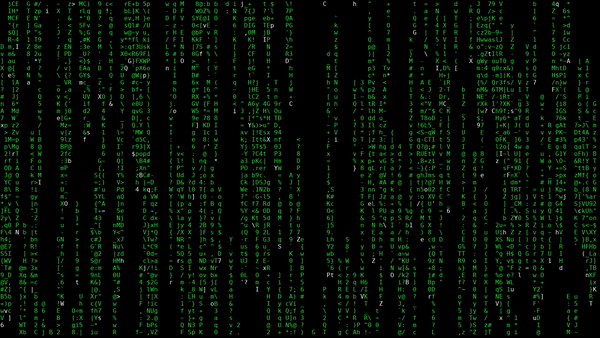

# matrix-effect
This is a dumb matrix effect type thing.\
It's only like one source file which should compile...\
Define __POSIX or __WIN though, for posix compatible or win systems...\
Also your terminal needs to support ANSI escape codes, no other dependencies.\
It even looks kinda nice though.



## Compile

There's a simple makefile that tries to autodetect your OS and build the application accordingly, so it should be enough to run make:
```
$ make
```

In case autodetection fails or you don't have make installed, you can always compile manually:
```
$ gcc -D __POSIX main.c -o matrix-effect
or
$ gcc -D __WIN main.c -o matrix-effect
```

## Install

If for whatever reason you'd like to be able to run this application from anywhere at all times, you can install it:
```
$ sudo make install
```
Afterwards you can run this command from anywhere
```
$ matrix-effect
```

## Uninstall

And if you want to get rid of it:
```
$ sudo make uninstall
```